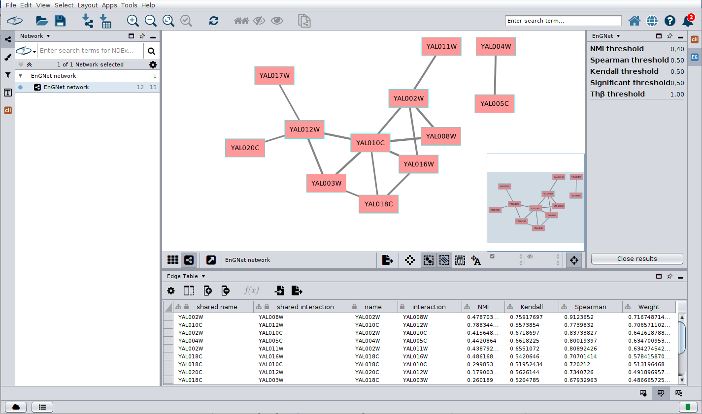

# CyEnGNet: *Cy*toscape *En*semble *G*ene *N*etwork

EnGNet proposes a new approach for the reconstruction of large gene coexpression networks. We present the CyEnGNet-app for Cytoscape, which is an improved implementation of the EnGNet methodology presented in the work by <a href="https://www.mdpi.com/1099-4300/21/12/1139">Delgado-Chaves et al. 2019</a>. This method is able to overcome the limitations of a single information-theoretic approach thanks to an ensemble strategy. Moreover, it performs topological optimization and has been integrated into Cytoscape to enhance tool accessibility for non-technical users and facilitate visual analysis of the results. 

The approach offers several relevant and distinguishing features in relation to most of the existing methods.
* The app uses a greedy algorithm which optimises both the size and the topology of the network. 
* The app facilitates the use of the EnGNet algorithm making it easy to use and visualise the final network. 
* The app integrates with Cytoscape’s main functions to perform deeper network analysis.

## Using EnGNet

First you need to install the app throug the app manager. If everything goes well, you will get a new item in the `Apps` menu called `EnGNet`.

Open EnGNet from the `Apps` menu and you'll be presented the configuration dialog. Load an gene expression data directly from the user folder to perform the evaluation, as well as different threshold values such as NMI, Kendall, Spearman, adding, and Th𝛽 (default values for each parameter are shown in the configuration panel). These files are expected to be in txt format separated by tabs at the top of the coniguration dialog. You can select the directory for the output files generated by the application.  

**Input file specifications:** The application expects a tab-delimited file. The file must have the following characteristics: in the first column the name of the genes. This column can contain gene identifiers, regardless of the origin of the identifier. Each row must represent a unique gene. The following columns are study samples of transcriptomic expression data. Each column corresponds to a sample and contains the gene expression levels associated with each gene in that sample. It is important that the gene expression data be log2-transformed to be compatible with the EnGNet application.

After running EnGNet you will get a network containing all the information generated by the algorithm. The results panel (on the right) shows the threshold values selected in the input panel. The edge table shows for each interaction the NMI, Kendall, Spearman and weight values calculated. To facilitate the exploration of the data in the network output, the width of each edge is determined by the final weight value calculated by the EnGNet algorithm.

The network has a basic style applied to facilitate visual exploration. 

**Note:** when downloading the repository you must modify the pom.xml file in the path to the JavaMI.java and jsc.java files by adding your own path.

## Reference
Gómez-Vela, F.; Delgado-Chaves, F.M.; Rodríguez-Baena, D.S.; García-Torres, M.; Divina, F. Ensemble and Greedy Approach for the Reconstruction of Large Gene Co-Expression Networks. Entropy 2019, 21, 1139. https://doi.org/10.3390/e21121139  

## Cite us
Under revision
  

## COPYRIGHT
* <a href="mailto:dmdelnav@upo.es">Maria del Saz Navarro</a> (<a href="mailto:dmdelnav@upo.es">dmdelnav@upo.es</a>)

Copyright © 2023 Universidad Pablo de Olavide, Spain.
