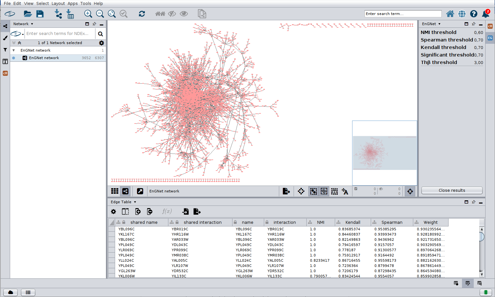

.. EnGNet-APP documentation master file, created by
   sphinx-quickstart on Fri Jul  7 11:11:55 2023.
   You can adapt this file completely to your liking, but it should at least
   contain the root `toctree` directive.

Welcome to EnGNet-APP's documentation!
======================================

EnGNet proposes a new approach for the reconstruction of large gene coexpression networks. We present the CyEnGNet-app for Cytoscape, which is an improved implementation of the EnGNet methodology presented in the work by Delgado-Chaves et al. 2019. This method is able to overcome the limitations of a single information-theoretic approach thanks to an ensemble strategy. Moreover, it performs topological optimization and has been integrated into Cytoscape to enhance tool accessibility for non-technical users and facilitate visual analysis of the results. 

**Documentation**

First you need to install the app throug the app manager. If everything goes well, you will get a new item in the `Apps` menu called `EnGNet`.

Open EnGNet from the `Apps` menu and you'll be presented the configuration dialog. Load an gene expression data directly from the user folder to perform the evaluation, as well as different
threshold values such as NMI, Kendall, Spearman, adding, and Th𝛽 (default values for each parameter are shown in the configuration panel). These files are expected to be in txt format separated by tabs at the top of the coniguration dialog.

.. image:: ../imagen/Fig2-inputParameter.png
	:alt: Input parameters in CyEnGNet-APP

After running EnGNet you will get a network containing all the information generated by the algorithm. The results panel (on the right) shows the threshold values selected in the input panel. The edge table shows for each interaction the NMI, Kendall, Spearman and weight values calculated. To facilitate the exploration of the data in the network output, the width of each edge is determined by the final weight value calculated by the EnGNet algorithm.

The network has a basic style applied to facilitate visual exploration. 

**Note:** when downloading the repository you must modify the pom.xml file in the path to the JavaMI.java and jsc.java files by adding your own path.

## Reference
Delgado-Chaves FM, Gómez-Vela F, García-Torres M, Divina F, Vázquez Noguera JL. Computational Inference of Gene Co-Expression Networks for the identification of Lung Carcinoma Biomarkers: An Ensemble Approach. Genes. 2019; 10(12):962. https://doi.org/10.3390/genes10120962 

The approach offers several relevant and distinguishing features in relation to most of the existing methods.
* The app uses a greedy algorithm which optimises both the size and the topology of the network. 
* The app facilitates the use of the EnGNet algorithm making it easy to use and visualise the final network. 
* The app integrates with Cytoscape’s main functions to perform deeper network analysis.

**Citing CyEnGNet-APP**\ :

If you use CyEnGNet-APP in a scientific publication, we would appreciate citations to the following paper::

   Under review

or::

    Under review

**Key Links and Resources**\ :

* `View the latest codes on Github <https://github.com/mariadsn/CyEnGNet-APP>`_
* `View the documentation & API <https://cyengnet-app.readthedocs.io/>`_

.. toctree::
   :maxdepth: 2
   :caption: Contents:
   

Indices and tables
==================

* :ref:`genindex`
* :ref:`modindex`
* :ref:`search`
